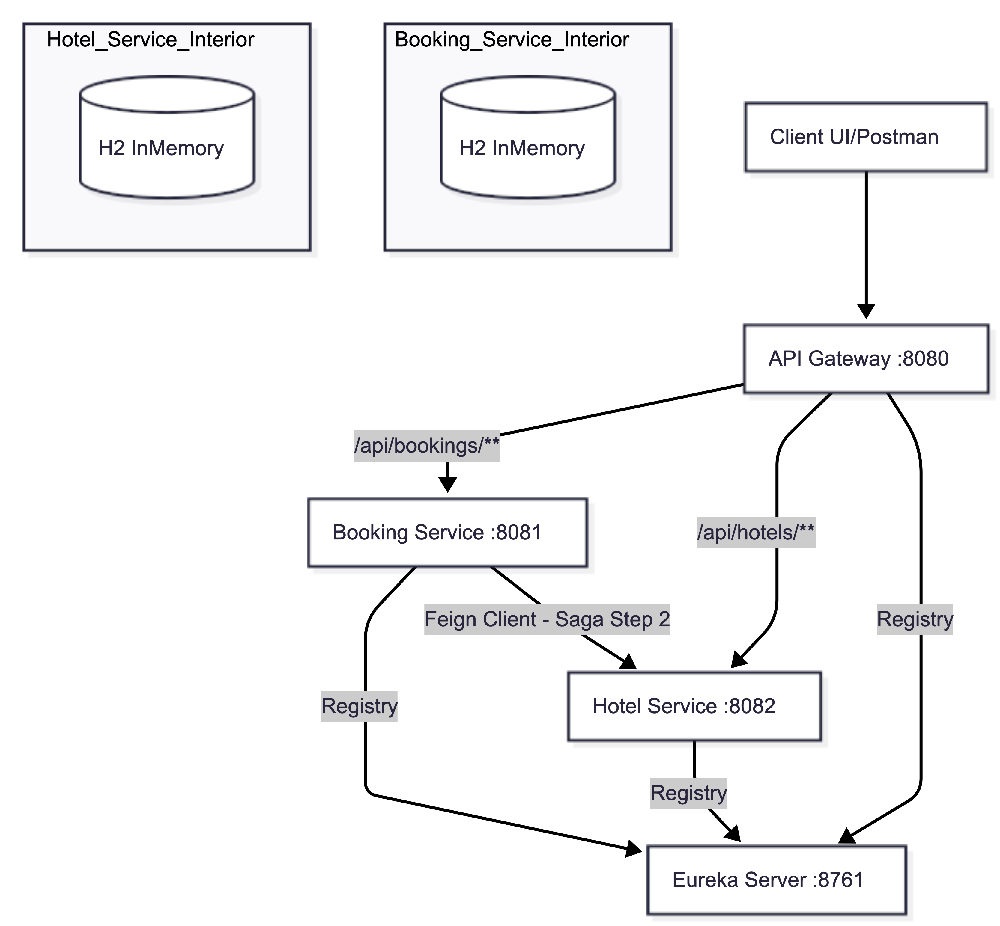

# Система бронирования отелей на микросервисах

Реализация системы бронирования отелей с использованием Spring Boot, Spring Cloud, Eureka и Spring Cloud Gateway в соответствии с заданием.

## Архитектура

*   **Eureka Server**: Сервер обнаружения сервисов (Порт 8761)
*   **API Gateway**: Единая точка входа (Порт 8080)
*   **Booking Service**: Логика бронирования, паттерн Сага (Saga), аутентификация пользователей (Порт 8081)
*   **Hotel Service**: Управление отелями/номерами, проверка доступности и статистика (Порт 8082)

## Схема Архитектуры



## ADR (Architecture Decision Records)

### 1. Выбор базы данных H2
**Решение:** Использовать In-Memory базу данных H2.
**Обоснование:** Требования к легкой переносимости и простоте запуска (без необходимости поднимать внешние БД вроде PostgreSQL в Docker для проверки задания). Для учебного проекта производительность H2 достаточна.

### 2. Реализация Саги (Saga)
**Решение:** Использовать оркестрацию на стороне Booking Service.
**Обоснование:** Booking Service выступает владельцем бизнес-процесса бронирования. Он инициирует транзакцию, делает синхронный вызов в Hotel Service и, в случае ошибки, выполняет компенсирующее действие (Release). Это проще в реализации и отладке, чем хореография через брокер сообщений, что соответствует принципу KISS.

### 3. Динамическое обнаружение сервисов
**Решение:** Использовать Eureka + Spring Cloud Gateway.
**Обоснование:** Стандартный стек Spring Cloud. Gateway автоматически получает маршруты от Eureka (`spring.cloud.gateway.discovery.locator.enabled=true`), что позволяет легко масштабировать сервисы без перенастройки шлюза.


## Требования
*   Docker и Docker Compose

## Как запустить
1.  Перейдите в корневую папку проекта.
2.  Выполните команду:
    ```bash
    docker-compose up --build
    ```
3.  Дождитесь регистрации всех сервисов в Eureka. Вы можете проверить панель Eureka по адресу `http://localhost:8761`.

## Использование API (Gateway доступен по адресу localhost:8080)

### 1. Аутентификация
*   **Регистрация пользователя**: `POST /api/user/register` -> `{"username": "newuser", "password": "password"}`
*   **Вход (Login)**: `POST /api/user/auth` -> `{"username": "user", "password": "user"}` (Предварительно созданный пользователь)
    *   Ответ: `{"token": "..."}`. Используйте этот токен в заголовке `Authorization: Bearer <token>` для последующих запросов.

### 2. Отели (Требуется аутентификация)
*   **Список отелей**: `GET /api/hotels`
*   **Список номеров (Рекомендованные)**: `GET /api/rooms/recommend` (Сортировка по популярности для равномерной загрузки)

### 3. Бронирование (Требуется аутентификация с ролью USER)
*   **Создать бронирование (Автоматический выбор комнаты)**: 
    `POST /api/booking`
    Тело запроса:
    ```json
    {
      "startDate": "2025-01-01",
      "endDate": "2025-01-05",
      "autoSelect": true
    }
    ```
*   **Мои бронирования**: `GET /api/bookings`

## Тестирование (Проверка Саги/Saga)
*   Юнит-тесты, покрывающие логику Распределенной Транзакции (Saga), находятся в файле `booking-service/src/test/java/com/skillfactory/booking/service/BookingServiceTest.java`.
*   Эти тесты используют моки (mock objects) для имитации успешных и ошибочных ответов от Hotel Service, проверяя корректность переходов статусов (PENDING -> CONFIRMED или CANCELLED) и вызова компенсации.
*   При сборке в Docker тесты по умолчанию пропускаются (`-DskipTests`) для ускорения развертывания, но вы можете запустить их локально через Maven или изменить Dockerfile.
